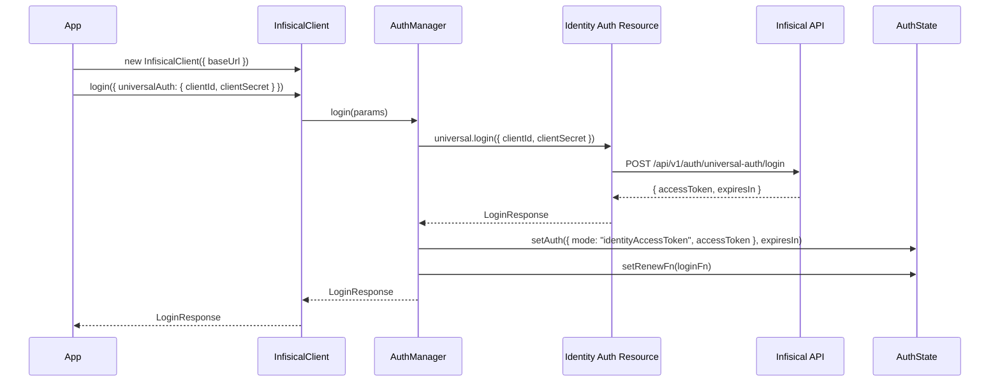
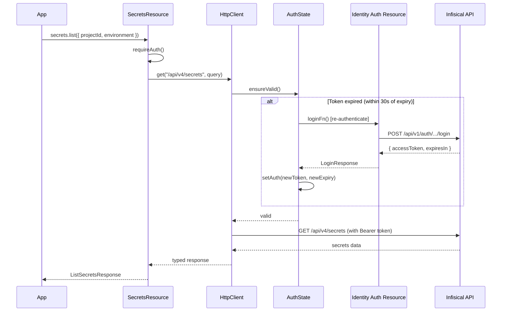
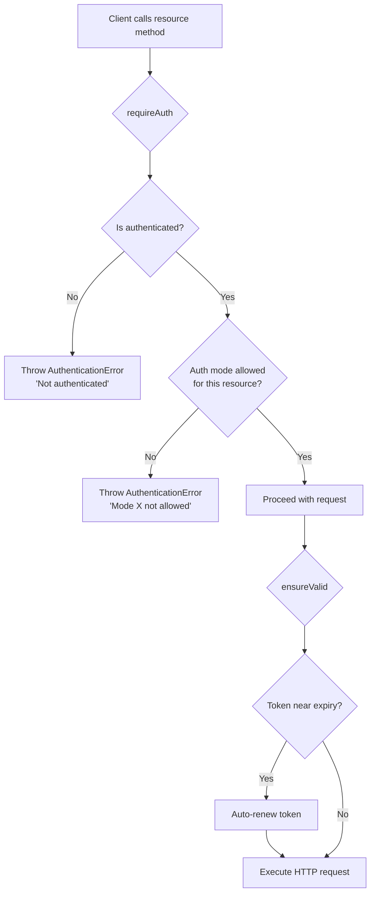

# @azerothian/infisical

[](https://www.npmjs.com/package/@azerothian/infisical)
[](https://opensource.org/licenses/MIT)

A TypeScript SDK for the [Infisical](https://infisical.com) API. Provides typed access to secrets management, identity authentication, PKI, KMS, and all other Infisical platform features.

- Zero dependencies (uses native `fetch`)
- Supports Node.js 18+
- Full TypeScript type definitions
- ESM and CommonJS builds
- Two-step authentication with auto-renewal

## Table of Contents

- [Installation](#installation)
- [Quick Start](#quick-start)
- [Authentication](#authentication)
  - [Login Methods](#login-methods)
  - [Auth Modes & Permissions](#auth-modes--permissions)
  - [Auto-Renewal](#auto-renewal)
  - [Auth State Inspection](#auth-state-inspection)
- [Architecture](#architecture)
  - [Login Flow](#login-flow)
  - [Auto-Renewal Flow](#auto-renewal-flow)
  - [Auth Mode Check Flow](#auth-mode-check-flow)
- [Configuration](#configuration)
- [Error Handling](#error-handling)
- [Releasing](#releasing)
- [API Reference](#api-reference)
  - [MFA](#mfa)
  - [MFA Sessions](#mfa-sessions)
  - [Users](#users)
  - [Password](#password)
  - [Service Tokens](#service-tokens)
  - [Organizations](#organizations)
  - [Organization Identities](#organization-identities)
  - [Identities](#identities)
  - [Identity Access Tokens](#identity-access-tokens)
  - [Identity Auth](#identity-auth)
  - [Projects](#projects)
  - [Secrets](#secrets)
  - [Secret Folders](#secret-folders)
  - [Secret Imports](#secret-imports)
  - [Secret Sharing](#secret-sharing)
  - [Secret Syncs](#secret-syncs)
  - [Webhooks](#webhooks)
  - [PKI Certificate Authorities](#pki-certificate-authorities)
  - [PKI Certificate Templates](#pki-certificate-templates)
  - [PKI Alerts](#pki-alerts)
  - [PKI Certificates](#pki-certificates)
  - [KMS](#kms)
  - [Integration Auth](#integration-auth)
  - [App Connections](#app-connections)
  - [Admin](#admin)
  - [Org Admin](#org-admin)

---

## Installation

```bash
npm install @azerothian/infisical
```

## Quick Start

```typescript
import { InfisicalClient } from "@azerothian/infisical";

const client = new InfisicalClient();

await client.login({
  universalAuth: { clientId: "YOUR_CLIENT_ID", clientSecret: "YOUR_CLIENT_SECRET" }
});

const secrets = await client.secrets.list({
  projectId: "my-project-id",
  environment: "production",
});

console.log(secrets);
```

## Authentication

The SDK uses a **two-step authentication** model. First, construct the client. Then, call `client.login()` with one of 12 identity auth methods. The returned access token is stored internally and sent automatically with every subsequent request.

### Login Methods

Pass exactly one auth method key to `client.login()`:

```typescript
// Universal Auth (client ID + secret)
await client.login({ universalAuth: { clientId: "...", clientSecret: "..." } });

// Token Auth
await client.login({ tokenAuth: { identityId: "..." } });

// AWS Auth
await client.login({ awsAuth: { identityId: "...", iamHttpRequestMethod: "...", iamRequestBody: "...", iamRequestHeaders: "..." } });

// GCP Auth
await client.login({ gcpAuth: { identityId: "...", jwt: "..." } });

// Azure Auth
await client.login({ azureAuth: { identityId: "...", jwt: "..." } });

// Kubernetes Auth
await client.login({ kubernetesAuth: { identityId: "...", jwt: "..." } });

// OIDC Auth
await client.login({ oidcAuth: { identityId: "...", jwt: "..." } });

// JWT Auth
await client.login({ jwtAuth: { identityId: "...", jwt: "..." } });

// LDAP Auth
await client.login({ ldapAuth: { identityId: "...", username: "...", password: "..." } });

// TLS Certificate Auth
await client.login({ tlsCertAuth: { identityId: "...", clientCertificate: "..." } });

// OCI Auth
await client.login({ ociAuth: { identityId: "...", userOcid: "...", requestHeaders: "..." } });

// AliCloud Auth
await client.login({ alicloudAuth: { identityId: "...", stsToken: "...", identityArn: "..." } });
```

### Auth Modes & Permissions

Each resource category in the SDK is restricted to a set of allowed auth modes. If you call a resource method with an incompatible mode, the SDK throws an `AuthenticationError` before making any network request.

| Resource Category | Allowed Auth Modes |
|---|---|
| `secrets`, `secretFolders`, `secretImports` | IAT, JWT, ST |
| `projects`, `organizations`, `organizationIdentities` | IAT, JWT |
| `identities`, `identityAuth`, `identityAccessTokens` | IAT, JWT |
| `pki`, `kms`, `secretTags` | IAT, JWT |
| `appConnections`, `secretSyncs`, `integrationAuth` | IAT, JWT |
| `admin`, `orgAdmin` | JWT only |
| `secretSharing`, `webhooks` | JWT only |
| `users`, `mfa`, `mfaSessions` | JWT only |
| `serviceTokens`, `password` | JWT only |

**IAT** = Identity Access Token (set by `client.login()`), **JWT** = User JWT, **ST** = Service Token (deprecated).

```typescript
import { AuthenticationError } from "@azerothian/infisical";

try {
  // login() sets mode to "identityAccessToken"
  await client.login({ universalAuth: { clientId: "...", clientSecret: "..." } });
  // admin requires JWT -- this will throw
  await client.admin.getConfig();
} catch (error) {
  if (error instanceof AuthenticationError) {
    console.error(`Auth mode "${error.currentMode}" not allowed`);
    console.error("Allowed modes:", error.allowedModes);
  }
}
```

### Auto-Renewal

When you authenticate via `client.login()`, the SDK stores the credentials and the token's `expiresIn` value. If a request is made within **30 seconds** of the token's expiry, the SDK transparently re-authenticates using the same credentials that were originally passed to `login()`.

Concurrent requests that hit the renewal window share a single renewal promise, so only one re-authentication call is made regardless of how many requests are in flight.

### Auth State Inspection

```typescript
client.isAuthenticated  // true if login() has been called and not yet logged out
client.authMode         // "identityAccessToken" | "jwt" | "apiKey" | "serviceToken" | null
client.logout()         // clears auth state, token, and renewal function
```

## Architecture

### Login Flow



### Auto-Renewal Flow



### Auth Mode Check Flow



## Configuration

```typescript
const client = new InfisicalClient({
  // Optional: base URL (defaults to https://app.infisical.com)
  baseUrl: "https://self-hosted.example.com",

  // Optional: request timeout in milliseconds (defaults to 30000)
  timeout: 60_000,

  // Optional: additional headers sent with every request
  headers: { "X-Custom-Header": "value" },

  // Optional: custom fetch implementation
  fetch: customFetchFn,
});
```

## Error Handling

All API errors are thrown as typed error classes. Network-level failures throw `InfisicalNetworkError`. Auth-mode violations throw `AuthenticationError` before any network call is made.

```typescript
import {
  InfisicalApiError,
  InfisicalNetworkError,
  AuthenticationError,
  BadRequestError,
  UnauthorizedError,
  ForbiddenError,
  NotFoundError,
  ValidationError,
  RateLimitError,
  InternalServerError,
} from "@azerothian/infisical";

try {
  await client.secretFolders.getById({ id: "non-existent" });
} catch (error) {
  if (error instanceof AuthenticationError) {
    console.error(`Auth mode "${error.currentMode}" not allowed`);
    console.error("Allowed modes:", error.allowedModes);
  } else if (error instanceof NotFoundError) {
    console.error("Folder not found:", error.message);
    console.error("Request ID:", error.requestId);
  } else if (error instanceof UnauthorizedError) {
    console.error("Invalid credentials");
  } else if (error instanceof RateLimitError) {
    console.error("Rate limited, retry later");
  } else if (error instanceof InfisicalApiError) {
    console.error(`API error ${error.statusCode}: ${error.message}`);
  } else if (error instanceof InfisicalNetworkError) {
    console.error("Network failure:", error.message, error.cause);
  }
}
```

| Error Class | HTTP Status | Description |
|---|---|---|
| `AuthenticationError` | N/A | Not authenticated, or auth mode not allowed for resource |
| `BadRequestError` | 400 | Malformed request |
| `UnauthorizedError` | 401 | Missing or invalid credentials |
| `ForbiddenError` | 403 | Insufficient permissions |
| `NotFoundError` | 404 | Resource not found |
| `ValidationError` | 422 | Request body validation failed |
| `RateLimitError` | 429 | Too many requests |
| `InternalServerError` | 500 | Server-side error |
| `InfisicalApiError` | Other | Catch-all for other HTTP error codes |
| `InfisicalNetworkError` | N/A | Connection failure, timeout, DNS error |

## Releasing

Releases are handled by the release script which automates version bumping, git tagging, GitHub releases, and npm publishing.

```bash
# Patch release (0.1.0 -> 0.1.1)
npm run release:patch

# Minor release (0.1.0 -> 0.2.0)
npm run release:minor

# Major release (0.1.0 -> 1.0.0)
npm run release:major
```

The release script (`scripts/release.sh`) performs the following steps:

1. Validates clean working tree on `master` branch
2. Runs the full test suite
3. Bumps the version in `package.json` and creates a git commit + tag (`vX.Y.Z`)
4. Builds the dist output
5. Pushes the commit and tag to `origin`
6. Creates a GitHub release with auto-generated release notes
7. Publishes the package to npm

**Prerequisites:**
- Authenticated with npm (`npm login`)
- Authenticated with GitHub CLI (`gh auth login`)
- On the `master` branch with no uncommitted changes

---

## API Reference

### Auth Legend

The **Auth** column in the tables below uses these abbreviations:

| Abbreviation | Meaning |
|---|---|
| **IAT** | Identity Access Token (`identityAccessToken` mode) |
| **JWT** | User JWT (`jwt` mode) |
| **API** | User API Key (`apiKey` mode) |
| **ST** | Service Token (`serviceToken` mode) -- deprecated |
| **None** | No authentication required (login endpoints) |

---

### MFA

Multi-factor authentication management for user sessions.

**Accessor:** `client.mfa`

| Method | HTTP | Path | Auth | Description |
|---|---|---|---|---|
| `resendToken()` | POST | `/auth/mfa/send` | JWT | Resend MFA verification token |
| `checkTotp()` | GET | `/auth/mfa/check/totp` | JWT | Check TOTP MFA status |
| `checkWebAuthn()` | GET | `/auth/mfa/check/webauthn` | JWT | Check WebAuthn MFA status |
| `verify(params)` | POST | `/auth/mfa/verify` | JWT | Verify MFA token |
| `verifyRecoveryCode(params)` | POST | `/auth/mfa/verify/recovery-code` | JWT | Verify MFA recovery code |

---

### MFA Sessions

Manage MFA session verification.

**Accessor:** `client.mfaSessions`

| Method | HTTP | Path | Auth | Description |
|---|---|---|---|---|
| `verify(params)` | POST | `/api/v2/mfa-sessions/{mfaSessionId}/verify` | JWT | Verify an MFA session |
| `getStatus(params)` | GET | `/api/v2/mfa-sessions/{mfaSessionId}/status` | JWT | Get MFA session status |

---

### Users

Manage the authenticated user's profile, API keys, sessions, and settings.

**Accessor:** `client.users`

| Method | HTTP | Path | Auth | Description |
|---|---|---|---|---|
| `getMe()` | GET | `/api/v2/users/me` | JWT | Get current user profile |
| `deleteMe()` | DELETE | `/api/v2/users/me` | JWT | Delete current user account |
| `updateName(params)` | PATCH | `/api/v2/users/me/name` | JWT | Update display name |
| `updateMfa(params)` | PATCH | `/api/v2/users/me/mfa` | JWT | Update MFA settings |
| `updateAuthMethods(params)` | PUT | `/api/v2/users/me/auth-methods` | JWT | Set allowed auth methods |
| `updateEmail(params)` | PATCH | `/api/v2/users/me/email` | JWT | Change email address |
| `requestEmailChangeOtp(params)` | POST | `/api/v2/users/me/email-change/otp` | JWT | Request OTP for email change |
| `sendEmailVerificationCode(params)` | POST | `/api/v2/users/me/emails/code` | JWT | Send email verification code |
| `verifyEmailVerificationCode(params)` | POST | `/api/v2/users/me/emails/verify` | JWT | Verify email code |
| `listOrganizations()` | GET | `/api/v2/users/me/organizations` | JWT | List user's organizations |
| `listApiKeys()` | GET | `/api/v2/users/me/api-keys` | JWT | List user API keys |
| `createApiKey(params)` | POST | `/api/v2/users/me/api-keys` | JWT | Create a new API key |
| `deleteApiKey(apiKeyDataId)` | DELETE | `/api/v2/users/me/api-keys/{apiKeyDataId}` | JWT | Delete an API key |
| `listSessions()` | GET | `/api/v2/users/me/sessions` | JWT | List active sessions |
| `revokeAllSessions()` | DELETE | `/api/v2/users/me/sessions` | JWT | Revoke all sessions |
| `revokeSession(sessionId)` | DELETE | `/api/v2/users/me/sessions/{sessionId}` | JWT | Revoke a specific session |

---

### Password

Password reset operations.

**Accessor:** `client.password`

| Method | HTTP | Path | Auth | Description |
|---|---|---|---|---|
| `reset(params)` | POST | `/api/v2/password/password-reset` | None | Reset password (unauthenticated, via email token) |
| `resetAuthenticated(params)` | POST | `/api/v2/password/user/password-reset` | JWT | Reset password while logged in |

---

### Service Tokens

Manage service tokens (deprecated -- use machine identities instead).

**Accessor:** `client.serviceTokens`

| Method | HTTP | Path | Auth | Description |
|---|---|---|---|---|
| `get()` | GET | `/api/v2/service-token` | JWT, ST | Get current service token details |
| `create(params)` | POST | `/api/v2/service-token` | JWT | Create a new service token |
| `delete(serviceTokenId)` | DELETE | `/api/v2/service-token/{serviceTokenId}` | JWT | Delete a service token |

---

### Organizations

Manage organizations, memberships, and related resources.

**Accessor:** `client.organizations`

| Method | HTTP | Path | Auth | Description |
|---|---|---|---|---|
| `create(params)` | POST | `/api/v2/organizations` | JWT, IAT | Create an organization |
| `delete(params)` | DELETE | `/api/v2/organizations/{orgId}` | JWT, IAT | Delete an organization |
| `upgradePrivilegeSystem()` | POST | `/api/v2/organizations/privilege-system-upgrade` | JWT, IAT | Upgrade privilege system |
| `listMemberships(params)` | GET | `/api/v2/organizations/{orgId}/memberships` | JWT, IAT | List org members |
| `getMembership(params)` | GET | `/api/v2/organizations/{orgId}/memberships/{membershipId}` | JWT, IAT | Get a membership |
| `updateMembership(params)` | PATCH | `/api/v2/organizations/{orgId}/memberships/{membershipId}` | JWT, IAT | Update a membership |
| `deleteMembership(params)` | DELETE | `/api/v2/organizations/{orgId}/memberships/{membershipId}` | JWT, IAT | Remove a member |
| `bulkDeleteMemberships(params)` | DELETE | `/api/v2/organizations/{orgId}/memberships` | JWT, IAT | Remove multiple members |
| `listProjectMembershipsByOrgMembership(params)` | GET | `/api/v2/organizations/{orgId}/memberships/{membershipId}/project-memberships` | JWT, IAT | List project memberships for an org member |
| `listProjects(params)` | GET | `/api/v2/organizations/{orgId}/workspaces` | JWT, IAT | List org projects |

---

### Organization Identities

List machine identities within an organization.

**Accessor:** `client.organizationIdentities`

| Method | HTTP | Path | Auth | Description |
|---|---|---|---|---|
| `list(params)` | GET | `/api/v2/organizations/{orgId}/identity-memberships` | JWT, IAT | List identity memberships in an org |

---

### Identities

CRUD operations for machine identities.

**Accessor:** `client.identities`

| Method | HTTP | Path | Auth | Description |
|---|---|---|---|---|
| `create(params)` | POST | `/api/v1/identities` | JWT, IAT | Create an identity |
| `update(params)` | PATCH | `/api/v1/identities/{identityId}` | JWT, IAT | Update an identity |
| `delete(params)` | DELETE | `/api/v1/identities/{identityId}` | JWT, IAT | Delete an identity |
| `get(params)` | GET | `/api/v1/identities/{identityId}` | JWT, IAT | Get identity details |
| `listProjectMemberships(params)` | GET | `/api/v1/identities/{identityId}/identity-memberships` | JWT, IAT | List project memberships for an identity |
| `search(params)` | GET | `/api/v1/organizations/{organizationId}/identities` | JWT, IAT | Search identities in an org |

---

### Identity Access Tokens

Renew and revoke machine identity access tokens.

**Accessor:** `client.identityAccessTokens`

| Method | HTTP | Path | Auth | Description |
|---|---|---|---|---|
| `renew(params)` | POST | `/api/v1/auth/token/renew` | IAT | Renew an access token |
| `revoke(params)` | POST | `/api/v1/auth/token/revoke` | IAT | Revoke an access token |

---

### Identity Auth

Authentication methods for machine identities. Each sub-resource follows a consistent pattern: a `login()` method that requires no authentication (it returns a token), and `attach`/`update`/`get`/`revoke` methods for managing the auth configuration on an identity.

All identity auth sub-resources are accessed via `client.identityAuth.<provider>`.

#### Universal Auth

**Accessor:** `client.identityAuth.universal`

| Method | HTTP | Path | Auth | Description |
|---|---|---|---|---|
| `login(params)` | POST | `/api/v1/auth/universal-auth/login` | None | Authenticate with client ID and secret |
| `attach(params)` | POST | `/api/v1/auth/universal-auth/identities/{identityId}` | JWT, IAT | Attach universal auth to an identity |
| `update(params)` | PATCH | `/api/v1/auth/universal-auth/identities/{identityId}` | JWT, IAT | Update universal auth config |
| `get(params)` | GET | `/api/v1/auth/universal-auth/identities/{identityId}` | JWT, IAT | Get universal auth config |
| `revoke(params)` | DELETE | `/api/v1/auth/universal-auth/identities/{identityId}` | JWT, IAT | Remove universal auth from identity |
| `createClientSecret(params)` | POST | `/api/v1/auth/universal-auth/identities/{identityId}/client-secrets` | JWT, IAT | Create a client secret |
| `listClientSecrets(params)` | GET | `/api/v1/auth/universal-auth/identities/{identityId}/client-secrets` | JWT, IAT | List client secrets |
| `getClientSecret(params)` | GET | `/api/v1/auth/universal-auth/identities/{identityId}/client-secrets/{clientSecretId}` | JWT, IAT | Get a client secret |
| `revokeClientSecret(params)` | DELETE | `/api/v1/auth/universal-auth/identities/{identityId}/client-secrets/{clientSecretId}` | JWT, IAT | Revoke a client secret |

**Example: Authenticate with Universal Auth**

```typescript
import { InfisicalClient } from "@azerothian/infisical";

const client = new InfisicalClient();

// login() calls POST /api/v1/auth/universal-auth/login, stores the token,
// and sets up auto-renewal.
const response = await client.login({
  universalAuth: {
    clientId: "YOUR_CLIENT_ID",
    clientSecret: "YOUR_CLIENT_SECRET",
  },
});

console.log("Authenticated, token expires in", response.expiresIn, "seconds");

// All subsequent calls use the stored token automatically.
const folders = await client.secretFolders.list({
  projectId: "project-id",
  environment: "production",
  path: "/",
});
```

#### Token Auth

**Accessor:** `client.identityAuth.token`

| Method | HTTP | Path | Auth | Description |
|---|---|---|---|---|
| `login(params)` | POST | `/api/v1/auth/token/login` | None | Authenticate with a token |
| `attach(params)` | POST | `/api/v1/auth/token/identities/{identityId}` | JWT, IAT | Attach token auth |
| `update(params)` | PATCH | `/api/v1/auth/token/identities/{identityId}` | JWT, IAT | Update token auth config |
| `get(params)` | GET | `/api/v1/auth/token/identities/{identityId}` | JWT, IAT | Get token auth config |
| `revoke(params)` | DELETE | `/api/v1/auth/token/identities/{identityId}` | JWT, IAT | Remove token auth |
| `createToken(params)` | POST | `/api/v1/auth/token/identities/{identityId}/tokens` | JWT, IAT | Create a token |
| `listTokens(params)` | GET | `/api/v1/auth/token/identities/{identityId}/tokens` | JWT, IAT | List tokens |
| `getToken(params)` | GET | `/api/v1/auth/token/identities/{identityId}/tokens/{tokenId}` | JWT, IAT | Get a token |
| `updateToken(params)` | PATCH | `/api/v1/auth/token/identities/{identityId}/tokens/{tokenId}` | JWT, IAT | Update a token |
| `revokeToken(params)` | DELETE | `/api/v1/auth/token/identities/{identityId}/tokens/{tokenId}` | JWT, IAT | Revoke a token |

#### AWS Auth

**Accessor:** `client.identityAuth.aws`

| Method | HTTP | Path | Auth | Description |
|---|---|---|---|---|
| `login(params)` | POST | `/api/v1/auth/aws-auth/login` | None | Authenticate via AWS IAM |
| `attach(params)` | POST | `/api/v1/auth/aws-auth/identities/{identityId}` | JWT, IAT | Attach AWS auth |
| `update(params)` | PATCH | `/api/v1/auth/aws-auth/identities/{identityId}` | JWT, IAT | Update AWS auth config |
| `get(params)` | GET | `/api/v1/auth/aws-auth/identities/{identityId}` | JWT, IAT | Get AWS auth config |
| `revoke(params)` | DELETE | `/api/v1/auth/aws-auth/identities/{identityId}` | JWT, IAT | Remove AWS auth |

#### GCP Auth

**Accessor:** `client.identityAuth.gcp`

| Method | HTTP | Path | Auth | Description |
|---|---|---|---|---|
| `login(params)` | POST | `/api/v1/auth/gcp-auth/login` | None | Authenticate via GCP |
| `attach(params)` | POST | `/api/v1/auth/gcp-auth/identities/{identityId}` | JWT, IAT | Attach GCP auth |
| `update(params)` | PATCH | `/api/v1/auth/gcp-auth/identities/{identityId}` | JWT, IAT | Update GCP auth config |
| `get(params)` | GET | `/api/v1/auth/gcp-auth/identities/{identityId}` | JWT, IAT | Get GCP auth config |
| `revoke(params)` | DELETE | `/api/v1/auth/gcp-auth/identities/{identityId}` | JWT, IAT | Remove GCP auth |

#### Azure Auth

**Accessor:** `client.identityAuth.azure`

| Method | HTTP | Path | Auth | Description |
|---|---|---|---|---|
| `login(params)` | POST | `/api/v1/auth/azure-auth/login` | None | Authenticate via Azure AD |
| `attach(params)` | POST | `/api/v1/auth/azure-auth/identities/{identityId}` | JWT, IAT | Attach Azure auth |
| `update(params)` | PATCH | `/api/v1/auth/azure-auth/identities/{identityId}` | JWT, IAT | Update Azure auth config |
| `get(params)` | GET | `/api/v1/auth/azure-auth/identities/{identityId}` | JWT, IAT | Get Azure auth config |
| `revoke(params)` | DELETE | `/api/v1/auth/azure-auth/identities/{identityId}` | JWT, IAT | Remove Azure auth |

#### Kubernetes Auth

**Accessor:** `client.identityAuth.kubernetes`

| Method | HTTP | Path | Auth | Description |
|---|---|---|---|---|
| `login(params)` | POST | `/api/v1/auth/kubernetes-auth/login` | None | Authenticate via Kubernetes SA token |
| `attach(params)` | POST | `/api/v1/auth/kubernetes-auth/identities/{identityId}` | JWT, IAT | Attach Kubernetes auth |
| `update(params)` | PATCH | `/api/v1/auth/kubernetes-auth/identities/{identityId}` | JWT, IAT | Update Kubernetes auth config |
| `get(params)` | GET | `/api/v1/auth/kubernetes-auth/identities/{identityId}` | JWT, IAT | Get Kubernetes auth config |
| `revoke(params)` | DELETE | `/api/v1/auth/kubernetes-auth/identities/{identityId}` | JWT, IAT | Remove Kubernetes auth |

#### OIDC Auth

**Accessor:** `client.identityAuth.oidc`

| Method | HTTP | Path | Auth | Description |
|---|---|---|---|---|
| `login(params)` | POST | `/api/v1/auth/oidc-auth/login` | None | Authenticate via OIDC provider |
| `attach(params)` | POST | `/api/v1/auth/oidc-auth/identities/{identityId}` | JWT, IAT | Attach OIDC auth |
| `update(params)` | PATCH | `/api/v1/auth/oidc-auth/identities/{identityId}` | JWT, IAT | Update OIDC auth config |
| `get(params)` | GET | `/api/v1/auth/oidc-auth/identities/{identityId}` | JWT, IAT | Get OIDC auth config |
| `revoke(params)` | DELETE | `/api/v1/auth/oidc-auth/identities/{identityId}` | JWT, IAT | Remove OIDC auth |

#### JWT Auth

**Accessor:** `client.identityAuth.jwt`

| Method | HTTP | Path | Auth | Description |
|---|---|---|---|---|
| `login(params)` | POST | `/api/v1/auth/jwt-auth/login` | None | Authenticate via external JWT |
| `attach(params)` | POST | `/api/v1/auth/jwt-auth/identities/{identityId}` | JWT, IAT | Attach JWT auth |
| `update(params)` | PATCH | `/api/v1/auth/jwt-auth/identities/{identityId}` | JWT, IAT | Update JWT auth config |
| `get(params)` | GET | `/api/v1/auth/jwt-auth/identities/{identityId}` | JWT, IAT | Get JWT auth config |
| `revoke(params)` | DELETE | `/api/v1/auth/jwt-auth/identities/{identityId}` | JWT, IAT | Remove JWT auth |

#### LDAP Auth

**Accessor:** `client.identityAuth.ldap`

| Method | HTTP | Path | Auth | Description |
|---|---|---|---|---|
| `login(params)` | POST | `/api/v1/auth/ldap-auth/login` | None | Authenticate via LDAP |
| `attach(params)` | POST | `/api/v1/auth/ldap-auth/identities/{identityId}` | JWT, IAT | Attach LDAP auth |
| `update(params)` | PATCH | `/api/v1/auth/ldap-auth/identities/{identityId}` | JWT, IAT | Update LDAP auth config |
| `get(params)` | GET | `/api/v1/auth/ldap-auth/identities/{identityId}` | JWT, IAT | Get LDAP auth config |
| `revoke(params)` | DELETE | `/api/v1/auth/ldap-auth/identities/{identityId}` | JWT, IAT | Remove LDAP auth |

#### TLS Certificate Auth

**Accessor:** `client.identityAuth.tlsCert`

| Method | HTTP | Path | Auth | Description |
|---|---|---|---|---|
| `login(params)` | POST | `/api/v1/auth/tls-cert-auth/login` | None | Authenticate via TLS client certificate |
| `attach(params)` | POST | `/api/v1/auth/tls-cert-auth/identities/{identityId}` | JWT, IAT | Attach TLS cert auth |
| `update(params)` | PATCH | `/api/v1/auth/tls-cert-auth/identities/{identityId}` | JWT, IAT | Update TLS cert auth config |
| `get(params)` | GET | `/api/v1/auth/tls-cert-auth/identities/{identityId}` | JWT, IAT | Get TLS cert auth config |
| `revoke(params)` | DELETE | `/api/v1/auth/tls-cert-auth/identities/{identityId}` | JWT, IAT | Remove TLS cert auth |

#### OCI Auth

**Accessor:** `client.identityAuth.oci`

| Method | HTTP | Path | Auth | Description |
|---|---|---|---|---|
| `login(params)` | POST | `/api/v1/auth/oci-auth/login` | None | Authenticate via Oracle Cloud Infrastructure |
| `attach(params)` | POST | `/api/v1/auth/oci-auth/identities/{identityId}` | JWT, IAT | Attach OCI auth |
| `update(params)` | PATCH | `/api/v1/auth/oci-auth/identities/{identityId}` | JWT, IAT | Update OCI auth config |
| `get(params)` | GET | `/api/v1/auth/oci-auth/identities/{identityId}` | JWT, IAT | Get OCI auth config |
| `revoke(params)` | DELETE | `/api/v1/auth/oci-auth/identities/{identityId}` | JWT, IAT | Remove OCI auth |

#### AliCloud Auth

**Accessor:** `client.identityAuth.alicloud`

| Method | HTTP | Path | Auth | Description |
|---|---|---|---|---|
| `login(params)` | POST | `/api/v1/auth/alicloud-auth/login` | None | Authenticate via Alibaba Cloud |
| `attach(params)` | POST | `/api/v1/auth/alicloud-auth/identities/{identityId}` | JWT, IAT | Attach AliCloud auth |
| `update(params)` | PATCH | `/api/v1/auth/alicloud-auth/identities/{identityId}` | JWT, IAT | Update AliCloud auth config |
| `get(params)` | GET | `/api/v1/auth/alicloud-auth/identities/{identityId}` | JWT, IAT | Get AliCloud auth config |
| `revoke(params)` | DELETE | `/api/v1/auth/alicloud-auth/identities/{identityId}` | JWT, IAT | Remove AliCloud auth |

---

### Projects

Manage projects (workspaces), their environments, roles, tags, and trusted IPs.

**Accessor:** `client.projects`

| Method | HTTP | Path | Auth | Description |
|---|---|---|---|---|
| `get(params)` | GET | `/api/v1/workspace/{projectId}` | JWT, IAT | Get project details |
| `update(params)` | PATCH | `/api/v1/workspace/{projectId}` | JWT, IAT | Update project settings |
| `delete(params)` | DELETE | `/api/v1/workspace/{projectId}` | JWT, IAT | Delete a project |
| `listMemberships(params)` | GET | `/api/v1/workspace/{projectId}/memberships` | JWT, IAT | List project members |
| `listEnvironments(params)` | GET | `/api/v1/workspace/{projectId}/environments` | JWT, IAT | List environments |
| `createEnvironment(params)` | POST | `/api/v1/workspace/{projectId}/environments` | JWT, IAT | Create an environment |
| `updateEnvironment(params)` | PATCH | `/api/v1/workspace/{projectId}/environments/{environmentId}` | JWT, IAT | Update an environment |
| `deleteEnvironment(params)` | DELETE | `/api/v1/workspace/{projectId}/environments/{environmentId}` | JWT, IAT | Delete an environment |
| `listRoles(params)` | GET | `/api/v1/workspace/{projectId}/roles` | JWT, IAT | List project roles |
| `listTags(params)` | GET | `/api/v1/workspace/{projectId}/tags` | JWT, IAT | List project tags |

---

### Secrets

Manage secrets within project environments.

**Accessor:** `client.secrets`

| Method | HTTP | Path | Auth | Description |
|---|---|---|---|---|
| `list(params)` | GET | `/api/v4/secrets` | JWT, IAT, ST | List secrets in an environment |
| `getByName(params)` | GET | `/api/v4/secrets/{secretName}` | JWT, IAT, ST | Get a secret by name |
| `getById(params)` | GET | `/api/v4/secrets/id/{secretId}` | JWT, IAT, ST | Get a secret by ID |
| `create(params)` | POST | `/api/v4/secrets/{secretName}` | JWT, IAT, ST | Create a secret |
| `update(params)` | PATCH | `/api/v4/secrets/{secretName}` | JWT, IAT, ST | Update a secret |
| `delete(params)` | DELETE | `/api/v4/secrets/{secretName}` | JWT, IAT, ST | Delete a secret |
| `batchCreate(params)` | POST | `/api/v4/secrets/batch` | JWT, IAT, ST | Batch create secrets |
| `batchUpdate(params)` | PATCH | `/api/v4/secrets/batch` | JWT, IAT, ST | Batch update secrets |
| `batchDelete(params)` | DELETE | `/api/v4/secrets/batch` | JWT, IAT, ST | Batch delete secrets |
| `move(params)` | POST | `/api/v4/secrets/move` | JWT, IAT, ST | Move secrets between paths |
| `getAccessList(params)` | GET | `/api/v1/secrets/{secretName}/access-list` | JWT, IAT, ST | Get access list for a secret |

---

### Secret Folders

Manage folders within project environments for organizing secrets.

**Accessor:** `client.secretFolders`

| Method | HTTP | Path | Auth | Description |
|---|---|---|---|---|
| `create(params)` | POST | `/api/v2/folders` | JWT, IAT | Create a folder |
| `update(params)` | PATCH | `/api/v2/folders/{folderId}` | JWT, IAT | Update a folder |
| `updateBatch(params)` | PATCH | `/api/v2/folders/batch` | JWT, IAT | Batch update folders |
| `delete(params)` | DELETE | `/api/v2/folders/{folderIdOrName}` | JWT, IAT | Delete a folder |
| `list(params)` | GET | `/api/v2/folders` | JWT, IAT | List folders |
| `getById(params)` | GET | `/api/v2/folders/{id}` | JWT, IAT | Get a folder by ID |

**Example: Create and list folders**

```typescript
// Create a folder
await client.secretFolders.create({
  projectId: "project-id",
  environment: "production",
  path: "/",
  name: "database-secrets",
});

// List folders
const folders = await client.secretFolders.list({
  projectId: "project-id",
  environment: "production",
  path: "/",
});
```

---

### Secret Imports

Import secrets from one environment/path into another.

**Accessor:** `client.secretImports`

| Method | HTTP | Path | Auth | Description |
|---|---|---|---|---|
| `create(params)` | POST | `/api/v2/secret-imports` | JWT, IAT | Create a secret import |
| `update(params)` | PATCH | `/api/v2/secret-imports/{secretImportId}` | JWT, IAT | Update a secret import |
| `delete(params)` | DELETE | `/api/v2/secret-imports/{secretImportId}` | JWT, IAT | Delete a secret import |
| `resyncReplication(params)` | POST | `/api/v2/secret-imports/{secretImportId}/replication-resync` | JWT, IAT | Resync replicated import |
| `list(params)` | GET | `/api/v2/secret-imports` | JWT, IAT | List secret imports |
| `get(params)` | GET | `/api/v2/secret-imports/{secretImportId}` | JWT, IAT | Get a secret import |
| `getRawSecrets(params)` | GET | `/api/v2/secret-imports/secrets` | JWT, IAT | Get raw imported secrets |

---

### Secret Sharing

Create and manage shared secrets with expiration and access controls.

**Accessor:** `client.secretSharing`

| Method | HTTP | Path | Auth | Description |
|---|---|---|---|---|
| `create(params)` | POST | `/api/v1/secret-sharing` | JWT, IAT | Create a shared secret |
| `delete(params)` | DELETE | `/api/v1/secret-sharing/{sharedSecretId}` | JWT, IAT | Delete a shared secret |
| `list()` | GET | `/api/v1/secret-sharing` | JWT, IAT | List shared secrets |
| `get(params)` | GET | `/api/v1/secret-sharing/{sharedSecretId}` | Mixed | Get a shared secret (public access may be allowed) |

---

### Secret Syncs

Synchronize secrets to external destinations (AWS Parameter Store, Vercel, GitHub, etc.).

**Accessor:** `client.secretSyncs`

| Method | HTTP | Path | Auth | Description |
|---|---|---|---|---|
| `create(params)` | POST | `/api/v1/secret-syncs/{destination}` | JWT, IAT | Create a sync |
| `update(params)` | PATCH | `/api/v1/secret-syncs/{destination}/{syncId}` | JWT, IAT | Update a sync |
| `delete(params)` | DELETE | `/api/v1/secret-syncs/{destination}/{syncId}` | JWT, IAT | Delete a sync |
| `get(params)` | GET | `/api/v1/secret-syncs/{destination}/{syncId}` | JWT, IAT | Get sync details |
| `list(params)` | GET | `/api/v1/secret-syncs/{destination}` | JWT, IAT | List syncs for a destination |
| `trigger(params)` | POST | `/api/v1/secret-syncs/{destination}/{syncId}/sync` | JWT, IAT | Trigger a sync manually |

---

### Webhooks

Manage project webhooks for secret change notifications.

**Accessor:** `client.webhooks`

| Method | HTTP | Path | Auth | Description |
|---|---|---|---|---|
| `create(params)` | POST | `/api/v1/webhooks` | JWT, IAT | Create a webhook |
| `update(params)` | PATCH | `/api/v1/webhooks/{webhookId}` | JWT, IAT | Update a webhook |
| `delete(params)` | DELETE | `/api/v1/webhooks/{webhookId}` | JWT, IAT | Delete a webhook |
| `list(params)` | GET | `/api/v1/webhooks` | JWT, IAT | List webhooks |
| `test(params)` | POST | `/api/v1/webhooks/{webhookId}/test` | JWT, IAT | Send a test webhook |

---

### PKI Certificate Authorities

List PKI certificate authorities.

**Accessor:** `client.pki.ca`

| Method | HTTP | Path | Auth | Description |
|---|---|---|---|---|
| `list(params)` | GET | `/api/v2/pki/ca` | JWT, IAT | List certificate authorities |

---

### PKI Certificate Templates

Manage certificate templates for issuing and signing certificates.

**Accessor:** `client.pki.templates`

| Method | HTTP | Path | Auth | Description |
|---|---|---|---|---|
| `create(params)` | POST | `/api/v2/pki/certificate-templates` | JWT, IAT | Create a certificate template |
| `update(params)` | PATCH | `/api/v2/pki/certificate-templates/{templateName}` | JWT, IAT | Update a template |
| `delete(params)` | DELETE | `/api/v2/pki/certificate-templates/{templateName}` | JWT, IAT | Delete a template |
| `get(params)` | GET | `/api/v2/pki/certificate-templates/{templateName}` | JWT, IAT | Get a template |
| `list(params)` | GET | `/api/v2/pki/certificate-templates` | JWT, IAT | List templates |
| `issueCertificate(params)` | POST | `/api/v2/pki/certificate-templates/{templateName}/issue-certificate` | JWT, IAT | Issue a certificate |
| `signCertificate(params)` | POST | `/api/v2/pki/certificate-templates/{templateName}/sign-certificate` | JWT, IAT | Sign a CSR |

---

### PKI Alerts

Manage PKI certificate expiration alerts.

**Accessor:** `client.pki.alerts`

| Method | HTTP | Path | Auth | Description |
|---|---|---|---|---|
| `create(params)` | POST | `/api/v2/pki/alerts` | JWT, IAT | Create an alert |
| `list(params)` | GET | `/api/v2/pki/alerts` | JWT, IAT | List alerts |
| `get(params)` | GET | `/api/v2/pki/alerts/{alertId}` | JWT, IAT | Get an alert |
| `update(params)` | PATCH | `/api/v2/pki/alerts/{alertId}` | JWT, IAT | Update an alert |
| `delete(params)` | DELETE | `/api/v2/pki/alerts/{alertId}` | JWT, IAT | Delete an alert |
| `listCertificates(params)` | GET | `/api/v2/pki/alerts/{alertId}/certificates` | JWT, IAT | List certificates for an alert |
| `previewCertificates(params)` | POST | `/api/v2/pki/alerts/preview/certificates` | JWT, IAT | Preview certificates matching alert criteria |

---

### PKI Certificates

Manage PKI certificates: create, retrieve, renew, revoke, and configure.

**Accessor:** `client.pki.certificates`

| Method | HTTP | Path | Auth | Description |
|---|---|---|---|---|
| `create(params)` | POST | `/api/v1/pki/certificates` | JWT, IAT | Create a certificate |
| `get(params)` | GET | `/api/v1/pki/certificates/{certificateId}` | JWT, IAT | Get certificate details |
| `getBody(params)` | GET | `/api/v1/pki/certificates/{certificateId}/certificate` | JWT, IAT | Get certificate body (PEM) |
| `getBundle(params)` | GET | `/api/v1/pki/certificates/{certificateId}/bundle` | JWT, IAT | Get certificate bundle |
| `getPrivateKey(params)` | GET | `/api/v1/pki/certificates/{certificateId}/private-key` | JWT, IAT | Get certificate private key |
| `renew(params)` | POST | `/api/v1/pki/certificates/{certificateId}/renew` | JWT, IAT | Renew a certificate |
| `revoke(params)` | POST | `/api/v1/pki/certificates/{certificateId}/revoke` | JWT, IAT | Revoke a certificate |
| `delete(params)` | DELETE | `/api/v1/pki/certificates/{certificateId}` | JWT, IAT | Delete a certificate |
| `updateConfig(params)` | PATCH | `/api/v1/pki/certificates/{certificateId}/config` | JWT, IAT | Update certificate config |

---

### KMS

Key Management Service for encrypting and decrypting data with managed keys.

**Accessor:** `client.kms`

| Method | HTTP | Path | Auth | Description |
|---|---|---|---|---|
| `createKey(params)` | POST | `/api/v1/kms/keys` | JWT, IAT | Create an encryption key |
| `updateKey(params)` | PATCH | `/api/v1/kms/keys/{keyId}` | JWT, IAT | Update key metadata |
| `deleteKey(params)` | DELETE | `/api/v1/kms/keys/{keyId}` | JWT, IAT | Delete a key |
| `getKey(params)` | GET | `/api/v1/kms/keys/{keyId}` | JWT, IAT | Get key details |
| `listKeys(params)` | GET | `/api/v1/kms/keys` | JWT, IAT | List keys |
| `encrypt(params)` | POST | `/api/v1/kms/keys/{keyId}/encrypt` | JWT, IAT | Encrypt data |
| `decrypt(params)` | POST | `/api/v1/kms/keys/{keyId}/decrypt` | JWT, IAT | Decrypt data |

**Example: Encrypt and decrypt data**

```typescript
// Create a key
const key = await client.kms.createKey({
  projectId: "project-id",
  name: "my-encryption-key",
});

// Encrypt
const encrypted = await client.kms.encrypt({
  keyId: key.id,
  plaintext: "sensitive-data",
});

// Decrypt
const decrypted = await client.kms.decrypt({
  keyId: key.id,
  ciphertext: encrypted.ciphertext,
});
```

---

### Integration Auth

Manage authentication credentials for third-party integrations.

**Accessor:** `client.integrationAuth`

| Method | HTTP | Path | Auth | Description |
|---|---|---|---|---|
| `create(params)` | POST | `/api/v1/integration-auth/access-token` | JWT, IAT | Create integration auth with access token |
| `get(params)` | GET | `/api/v1/integration-auth/{integrationAuthId}` | JWT, IAT | Get integration auth details |
| `delete(params)` | DELETE | `/api/v1/integration-auth/{integrationAuthId}` | JWT, IAT | Delete integration auth |
| `list(params)` | GET | `/api/v1/integration-auth` | JWT, IAT | List integration auths |

---

### App Connections

Manage connections to external applications.

**Accessor:** `client.appConnections`

| Method | HTTP | Path | Auth | Description |
|---|---|---|---|---|
| `create(params)` | POST | `/api/v1/app-connections/{app}` | JWT, IAT | Create a connection |
| `update(params)` | PATCH | `/api/v1/app-connections/{app}/{connectionId}` | JWT, IAT | Update a connection |
| `delete(params)` | DELETE | `/api/v1/app-connections/{app}/{connectionId}` | JWT, IAT | Delete a connection |
| `get(params)` | GET | `/api/v1/app-connections/{app}/{connectionId}` | JWT, IAT | Get connection details |
| `list(params)` | GET | `/api/v1/app-connections/{app}` | JWT, IAT | List connections for an app |

---

### Admin

Super admin endpoints for managing the Infisical instance: configuration, user management, organization management, identity management, integrations, encryption, cache, and usage reports.

**Accessor:** `client.admin`

| Method | HTTP | Path | Auth | Description |
|---|---|---|---|---|
| `bootstrap(params)` | POST | `/api/v1/admin/bootstrap` | None | Bootstrap a new Infisical instance |
| `signup(params)` | POST | `/api/v1/admin/signup` | None | Admin sign up |
| `getConfig()` | GET | `/api/v1/admin/config` | None | Get server configuration |
| `updateConfig(params)` | PATCH | `/api/v1/admin/config` | JWT, IAT | Update server configuration |
| `listUsers(params?)` | GET | `/api/v1/admin/user-management/users` | JWT, IAT | List all users |
| `deleteUser(params)` | DELETE | `/api/v1/admin/user-management/users/{userId}` | JWT, IAT | Delete a user |
| `deleteUsers(params)` | DELETE | `/api/v1/admin/user-management/users` | JWT, IAT | Bulk delete users |
| `grantAdminAccess(params)` | PATCH | `/api/v1/admin/user-management/users/{userId}/admin-access` | JWT, IAT | Grant super admin access to a user |
| `revokeAdminAccess(params)` | DELETE | `/api/v1/admin/user-management/users/{userId}/admin-access` | JWT, IAT | Revoke super admin access from a user |
| `listOrganizations(params?)` | GET | `/api/v1/admin/organization-management/organizations` | JWT, IAT | List all organizations |
| `createOrganization(params)` | POST | `/api/v1/admin/organization-management/organizations` | JWT, IAT | Create an organization |
| `deleteOrganization(params)` | DELETE | `/api/v1/admin/organization-management/organizations/{organizationId}` | JWT, IAT | Delete an organization |
| `deleteOrgMembership(params)` | DELETE | `/api/v1/admin/organization-management/organizations/{organizationId}/memberships/{membershipId}` | JWT, IAT | Remove a member from an organization |
| `resendOrgInvite(params)` | POST | `/api/v1/admin/organization-management/organizations/{organizationId}/memberships/{membershipId}/resend-invite` | JWT, IAT | Resend an organization invite |
| `joinOrganization(params)` | POST | `/api/v1/admin/organization-management/organizations/{organizationId}/access` | JWT | Join an organization as admin |
| `listIdentities(params?)` | GET | `/api/v1/admin/identity-management/identities` | JWT, IAT | List all identities |
| `revokeIdentitySuperAdmin(params)` | DELETE | `/api/v1/admin/identity-management/identities/{identityId}/super-admin-access` | JWT, IAT | Revoke super admin access from an identity |
| `getIntegrations()` | GET | `/api/v1/admin/integrations` | JWT, IAT | Get admin integrations (Slack, Teams, GitHub) |
| `getEncryptionStrategies()` | GET | `/api/v1/admin/encryption-strategies` | JWT, IAT | List encryption strategies |
| `updateEncryptionStrategy(params)` | PATCH | `/api/v1/admin/encryption-strategies` | JWT, IAT | Update encryption strategy |
| `getEnvOverrides()` | GET | `/api/v1/admin/env-overrides` | JWT, IAT | Get environment variable overrides |
| `invalidateCache(params)` | POST | `/api/v1/admin/invalidate-cache` | JWT, IAT | Invalidate server cache |
| `getCacheStatus()` | GET | `/api/v1/admin/invalidating-cache-status` | JWT, IAT | Get cache invalidation status |
| `generateUsageReport()` | POST | `/api/v1/admin/usage-report/generate` | JWT, IAT | Generate a usage report (CSV) |

---

### Org Admin

Organization admin endpoints for managing projects across the organization.

**Accessor:** `client.orgAdmin`

| Method | HTTP | Path | Auth | Description |
|---|---|---|---|---|
| `listProjects(params?)` | GET | `/api/v1/org-admin/projects` | JWT, IAT | List all projects in the organization |
| `grantProjectAccess(params)` | POST | `/api/v1/org-admin/projects/{projectId}/grant-admin-access` | JWT | Grant admin access to a project |

---

## License

MIT
